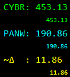
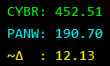
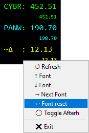
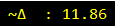

<h1>Simple Stock Price Ticker Widget</h1>

A minimal, always-on-top, movable, and scalable stock price ticker widget.
It uses no external libraries and performs basic scraping to show during-trading and after-hours prices.
Supports a single-line calculation that can reference the same ticker names.

<h2>Features</h2>
<ul>
  <li><strong>Always on top</strong>, minimal UI</li>
  <li><strong>Movable</strong> (drag to reposition)</li>
  <li><strong>Scalable</strong> (adjust font size)</li>
  <li><strong>Basic scraping</strong> for live and after-hours prices</li>
  <li><strong>Inline calculation</strong> using the same ticker symbols (e.g., <code>(PANW * 2.2005 + 45) - CYBR</code>)</li>
</ul>

<h2>Configuration (<code>Config.json</code>)</h2>

Keys:

<ul>
  <li><code>"stocks"</code>: <em>array</em> — List of ticker symbols. Examples: <code>["GOOG", "CYBR", "PANW"]</code></li>
  <li><code>"interval_minutes"</code>: <em>integer</em> — Update interval in minutes</li>
  <li><code>"calculation"</code>: <em>string (optional)</em> — A single-line formula using the ticker names. Example: <code>"(PANW * 2.2005 + 45) - CYBR"</code></li>
</ul>

  
Example <code>Config.json</code>

  <pre><code>{
  "stocks": ["GOOG", "CYBR", "PANW"],
  "interval_minutes": 2,
  "calculation": "(PANW * 2.2005 + 45) - CYBR"
}
  </code></pre>

<h2>Controls</h2>
<ol>
  <li><strong>Drag</strong>: Click and drag to move the widget</li>
  <li><strong>Ctrl + Mouse Wheel</strong>: Increase/decrease font size</li>
  <li><strong>Double-click</strong>: Toggle showing only the calculation line (the line can also be just a single ticker)</li>
  <li><strong>Right-Click Menu</strong>
    <ul>
      <li><strong>Refresh</strong>: Manual value refresh</li>
      <li><strong>Font (inc)</strong>: Increase font size by 1</li>
      <li><strong>Font (dec)</strong>: Decrease font size by 1</li>
      <li><strong>Next Font</strong>: Cycle through supported fonts</li>
      <li><strong>Font reset</strong>: Reset to starting size and type</li>
      <li><strong>Toggle Afterh</strong>: Toggle after-hours prices on/off</li>
    </ul>
  </li>
</ol>

<h2>Notes</h2>
<ul>
  <li>Calculation expressions must reference valid ticker names from <code>"stocks"</code>.</li>
  <li>After-hours data availability may vary by ticker and data source.</li>
</ul>

Full view:   
During trading only view:   
Right click menu:   
Mini view:   

